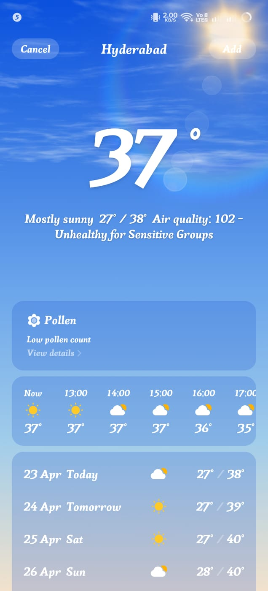
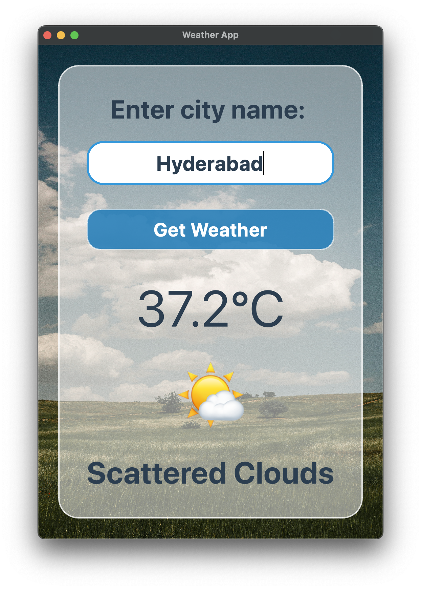

<h1 align="center">Weather App</h1>

<p align="center">
	A modern desktop Weather App built with Python and PyQt5 that fetches real-time weather data from the OpenWeatherMap API.
</p>

<p align="center">
	
</p>

<p align="center">
	
</p>

## Why This Project Stands Out

- Glassmorphism-inspired UI with a clean, premium look
- Real-time city weather search using OpenWeatherMap
- Friendly visual feedback with weather emoji and readable status messages
- Handles common network and API errors gracefully
- Beginner-friendly code structure with clear widget and logic separation

## Features

- Search weather by city name
- Displays:
	- Temperature in Celsius
	- Weather description
	- Visual emoji indicator
- Strong error handling for:
	- Invalid city names
	- Unauthorized API access
	- Network failures/timeouts
	- Server-side API issues

## Quick Start

### 1. Clone the repository

```bash
git clone <your-repository-url>
cd "Weather APP"
```

### 2. Create and activate a virtual environment (recommended)

```bash
python3 -m venv .venv
source .venv/bin/activate
```

### 3. Install dependencies

```bash
pip install pyqt5 requests
```

### 4. Add your OpenWeatherMap API key

Open [main.py](main.py) and replace the value of `api_key` in the `get_weather` method with your own key.

```python
api_key = "YOUR_API_KEY_HERE"
```

Get a free key from: https://openweathermap.org/api

### 5. Run the app

```bash
python3 main.py
```

## Tech Stack

- Python 3
- PyQt5 (desktop UI)
- Requests (API calls)
- OpenWeatherMap API

## Project Structure

```text
Weather APP/
├── main.py
└── Readme.md
```

## Demo Checklist (For Presentation)

Use this flow to impress users quickly:

1. Enter a popular city (for example: London, Tokyo, New York).
2. Show instant weather output with temperature and description.
3. Demonstrate a wrong city input to show robust error handling.
4. Mention the modern UI and API integration as key value points.

## Future Improvements

- Add dynamic weather icons based on condition codes
- Add multi-city favorites panel
- Add unit toggle (Celsius/Fahrenheit)
- Move API key to environment variables for better security
- Package as an installable desktop app

## Author

Made with Python and PyQt5.

If this project helped you, consider starring the repository.

<h1 align="center"> Demo Images & Video </h1>

Watch the recorded demo:

- [Watch Demo Video YouTube URL:](https://youtu.be/-lTIGDLnd6U?si=TfwWjLT3ErdktS3n)
- View App screenshots below with proof : 

<p align="center">
  <table>
    <tr>
      <td align="center">
        
        <br />
        <b>proof: Default phone weather app</b>
      </td>
      <td align="center">
        
        <br />
        <b>Demo</b>
      </td>
    </tr>
  </table>
</p>

<p align="center">
	
</p>
